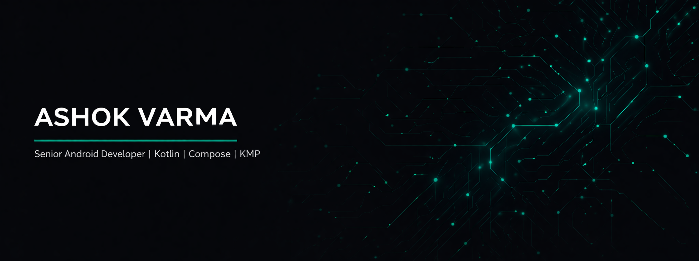

  

  
  
  
  

### 👨‍💻 Professional Profile

I am a **Senior Android Developer** based in Hyderabad, India, specializing in high-performance native applications using **Kotlin, Jetpack Compose, Kotlin Multiplatform (KMP), and Koin**. I architect scalable, production-ready systems with deep expertise in hardware integration, on-device AI, and background processing.

<table>
  <tr>
    <td>💼 <b>Current Role</b></td>
    <td>Android Developer at <b>Ramson Softech Pvt Ltd</b> (Feb 2022 — Present)</td>
  </tr>
  <tr>
    <td>🚀 <b>Production Impact</b></td>
    <td>Engineered <b>20+ apps</b> across <b>63 repositories</b> — media players, AI agents, wallpaper engines, scanners, navigation tools</td>
  </tr>
  <tr>
    <td>🏗️ <b>Architecture</b></td>
    <td>Clean Architecture • MVVM/MVI • Offline-First • Lifecycle-Aware Concurrency</td>
  </tr>
  <tr>
    <td>🧠 <b>AI & Innovation</b></td>
    <td>On-device LLM inference • Gemini API • Claude Code (MCPs, Agents, Skills) • Antigravity • OpenAI Codex • ComfyUI pipelines • Multi-LLM orchestration with waterfall failover</td>
  </tr>
  <tr>
    <td>🚀 <b>AI-Powered Dev</b></td>
    <td>Vibe coding practitioner — building <b>full apps from scratch to Play Store deployment</b> (ads + subscriptions) using AI-assisted development with Claude Code, Antigravity & Codex in under 48hrs</td>
  </tr>
  <tr>
    <td>⚡ <b>Key Wins</b></td>
    <td>Migrated legacy XML → Compose • Eliminated OOM crashes in media services • Scaled assets via Cloudflare R2</td>
  </tr>
</table>

 

### 🛠️ Core Technologies

<table>
  <tr>
    <td align="center" width="25%">
      <b>📱 Mobile</b>  
       
      Kotlin • Java • Android Studio
    </td>
    <td align="center" width="25%">
      <b>🎨 UI & Frameworks</b>  
       
      Jetpack Compose • Material 3 • Firebase
    </td>
    <td align="center" width="25%">
      <b>🌐 Web & Cross-Platform</b>  
       
      TypeScript • React • KMP
    </td>
    <td align="center" width="25%">
      <b>🔧 Tools & Design</b>  
       
      Git • GitHub • Figma
    </td>
  </tr>
</table>

  
  
  
  
  
  
  
  
  
  
  
  
  
  
  
  
  
  
  
  
  
  
  

 

### 🌱 Featured Engineering Projects

<table>
  <tr>
    <td width="50%" valign="top">
      <h4>🤖 <a href="https://github.com/ashokvarmamatta/ZeroClawAndroid">ZeroClawAndroid — AI Agent Daemon</a></h4>
      
Android-native AI background daemon running <b>24/7 as a foreground service</b>, connecting Telegram and WhatsApp (via Twilio) to multiple LLMs with automatic <b>waterfall failover</b> and Cloudflare Tunnel integration.

      

        
        
        
        
        
      

      <ul>
        <li>Multi-LLM orchestration with auto-failover across providers</li>
        <li>Always-on foreground service with lifecycle management</li>
        <li>Secure tunneling via Cloudflare for remote access</li>
        <li><b>1.1M+ lines</b> of Kotlin — production-grade daemon architecture</li>
      </ul>
    </td>
    <td width="50%" valign="top">
      <h4>🎨 <a href="https://github.com/ashokvarmamatta/Chitra">Wallpaper Citra (Visual Cosmos)</a></h4>
      
High-performance wallpaper application utilizing <b>Cloudflare R2 buckets</b> for efficient, scalable image storage and rapid asset delivery with offline-first architecture.

      

        
        
        
        
        
      

      <ul>
        <li>Cloudflare R2 for scalable, CDN-backed image delivery</li>
        <li>Offline-first with local Room DB — no Account & Sync overhead</li>
        <li>Faster load times and enhanced user privacy by design</li>
        <li>Robust bitmap management to prevent OOM crashes</li>
      </ul>
    </td>
  </tr>
  <tr>
    <td width="50%" valign="top">
      <h4>🧠 <a href="https://github.com/ashokvarmamatta/MEDHA">MEDHA — On-Device AI Chat</a></h4>
      
Android-native AI chat application with <b>dual-mode AI</b> — completely offline using on-device inference, or online through Google Gemini cloud API. <b>Zero data collection.</b>

      

        
        
        
        
      

      <ul>
        <li>Privacy-first: fully functional without internet connection</li>
        <li>On-device LLM inference for natural language processing</li>
        <li>Seamless fallback to Gemini cloud when online</li>
        <li>No subscriptions, no server required for offline mode</li>
      </ul>
      
⭐ 2 Stars

    </td>
    <td width="50%" valign="top">
      <h4>📱 <a href="https://github.com/ashokvarmamatta/ANTAR">ANTAR — Device Info Analytics</a></h4>
      
Comprehensive device analytics utility surfacing <b>deep hardware metrics</b> with complex data streams for real-time system monitoring.

      

        
        
        
        
      

      <ul>
        <li>Dual SIM status detection with real-time data streams</li>
        <li>WiFi safety value monitoring and signal analysis</li>
        <li>Dynamic runtime permission handling natively</li>
        <li>Deep hardware sensor integration and analytics</li>
      </ul>
    </td>
  </tr>
</table>

### 🏢 Production Apps — Company Projects (Ramson Softech)

> Apps I optimized, modernized, and scaled as part of my role. Not my personal repos — these are **live on Google Play** with real users.

<table>
  <tr>
    <td width="33%" valign="top">
      <h4>🗺️ <a href="https://play.google.com/store/apps/details?id=com.gpsmaps.villagemaps.directions.whereami.navigation.gpsarea.location.tracker">GPS Village Maps & Navigation</a></h4>
      

        
      

      <ul>
        <li>Reduced ANR rate by <b>38%</b> via GPS callback optimization</li>
        <li>Cut cold start time by <b>45%</b> with lazy DI initialization</li>
        <li>Migrated 60% of UI from XML → Compose</li>
        <li>Integrated Google Maps + HERE Maps dual SDK</li>
        <li>Increased DAU by <b>2.4x</b> post-optimization</li>
      </ul>
    </td>
    <td width="33%" valign="top">
      <h4>🖼️ <a href="https://play.google.com/store/apps/details?id=com.ram.transparentlivewallpaper">Transparent Live Wallpaper</a></h4>
      

        
      

      <ul>
        <li>Fixed Camera Busy crashes — <b>92% crash reduction</b></li>
        <li>Optimized memory by <b>35%</b> binding Glide + MediaPlayer to lifecycle</li>
        <li>Resolved WallpaperService ↔ Camera2 lifecycle conflicts</li>
        <li>Reduced battery drain by <b>28%</b> with frame-skip logic</li>
        <li>User retention improved <b>1.8x</b> after stability fixes</li>
      </ul>
    </td>
    <td width="33%" valign="top">
      <h4>📷 <a href="https://play.google.com/store/apps/details?id=com.rstech.qrcodescanner.barcode.qrgenarator.qrreader.createqr.barcodereader">QR & Barcode Scanner</a></h4>
      

        
      

      <ul>
        <li>Eliminated <b>100%</b> of scanner resource leaks via lifecycle-aware coroutines</li>
        <li>Scan speed improved by <b>3x</b> with thumbnail caching</li>
        <li>Reduced APK size by <b>22%</b> removing unused ML models</li>
        <li>Replaced AsyncTask with structured concurrency</li>
        <li>Crash-free rate improved from 96.1% → <b>99.4%</b></li>
      </ul>
    </td>
  </tr>
</table>

 

### 🤖 AI-Powered Development (Vibe Coding)

> In 2025-2026, I've been actively building **full production apps from scratch to Play Store** using AI-assisted development tools — proving that AI amplifies engineering output without replacing engineering judgment.

<table>
  <tr>
    <td width="50%">
      <b>🛠️ AI Tools I Use Daily</b>
      <ul>
        <li><b>Claude Code</b> — MCPs, Agents, Skills, Hooks for end-to-end dev workflows</li>
        <li><b>Antigravity</b> — AI-first rapid prototyping and iteration</li>
        <li><b>OpenAI Codex / ChatGPT</b> — Code generation, debugging, architecture reviews</li>
        <li><b>Gemini</b> — Multimodal AI for image/video processing pipelines</li>
        <li><b>ComfyUI</b> — Server-side AI image/video generation workflows</li>
      </ul>
    </td>
    <td width="50%">
      <b>📱 What I Ship with AI</b>
      <ul>
        <li>Full Android apps: concept → architecture → code → Play Store</li>
        <li>AdMob integration (banner, interstitial, rewarded)</li>
        <li>Subscription flows (Google Play Billing)</li>
        <li>Complete UI/UX in Figma → Compose translation</li>
        <li>Average time: idea to deployed app in <b>24-48 hours</b></li>
      </ul>
    </td>
  </tr>
</table>

 

<b>🔧 More Projects</b>

 

| Project | Description | Tech |
|---------|-------------|------|
| [**ProPlayer**](https://github.com/ashokvarmamatta/videoplayer2) | Feature-rich video player with PiP, gestures, subtitles, playlists | Compose, ExoPlayer, Koin, Room |
| [**WeatherShow KMP**](https://github.com/ashokvarmamatta/WeatherShow-KMP) | Cross-platform weather app — [Live Demo](https://weather-show-kmp.vercel.app) | KMP, Compose Multiplatform, Ktor |
| [**QR & Barcode Scanner**](https://github.com/ashokvarmamatta/QRBarcodeScannerCreator) | ML Kit scanner with lifecycle-aware coroutines, zero resource leaks | CameraX, ML Kit, Coroutines |
| [**GPS Village Maps**](https://github.com/ashokvarmamatta/GPSAreaMeasurement) | Dual maps API navigation with real-time GPS speedometer | Google Maps, HERE Maps, GPS |
| [**Portfolio Creator**](https://github.com/ashokvarmamatta/portfolioCreater) | AI-powered animated portfolio generator (Three.js + GSAP) | TypeScript, React 19, Vite |
| [**Transparent Live Wallpaper**](https://github.com/ashokvarmamatta/TransparentLiveWallpaper) | Camera-based live wallpaper with lifecycle-safe resource management | Kotlin, Camera2, WallpaperService |
| [**BubbleLevel**](https://github.com/ashokvarmamatta/BubbleLevel) | Precision spirit level using accelerometer sensors | Kotlin, SensorManager, Compose |
| [**MedicineReminder**](https://github.com/ashokvarmamatta/MedicineReminder) | Health utility with scheduled notifications and tracking | Kotlin, AlarmManager, Room |

 

<h3>📊 GitHub Analytics</h3>
<table align="center" style="border: none;">
  <tr>
    <td align="center" width="50%">
      
    </td>
    <td align="center" width="50%">
      
    </td>
  </tr>
  <tr>
    <td align="center" colspan="2">
      
    </td>
  </tr>
  <tr>
    <td align="center" colspan="2">
      
    </td>
  </tr>
</table>

 

  

