  
  
  

 

  

 

#### 👷 Check out what I'm currently working on

#### 🌱 My latest project

#### 🔭 Latest releases I've contributed to

#### ⭐ Recent Stars

## 🏆 GitHub Trophies

### :woman_technologist: About Me :

##  Contact

